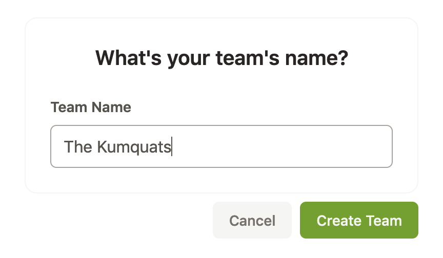
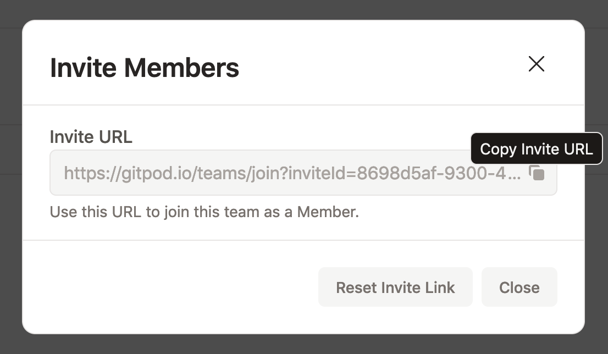
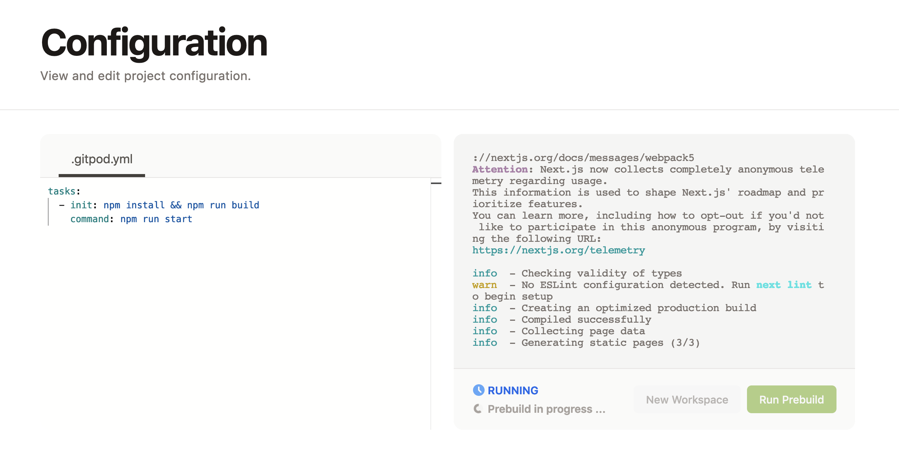

Our mission here at Gitpod has always been about removing friction from the lives of developers.

Today, we're excited to share with you the next big step in this journey—Teams and Projects.

## Wait, what

At its heart, Gitpod is a CI/CD system for dev environments. It provides your team with consistent, standardized and fully-automated dev environments. When you use Gitpod, you can launch new workspaces in a flash, for any project and any context, and then throw them away again when the job is done.

**Disposable workspaces feel like inbox-zero 🧘‍♀️**

But before you and your team can get there, there have always been a few caveats, a few obstacles standing annoyingly between you and that frictionless dev experience:

- It's complicated to describe your project's setup in the [.gitpod.yml](https://www.gitpod.io/docs/config-gitpod-file/) syntax
- It's complicated to enable [Prebuilds](https://www.gitpod.io/docs/prebuilds/) for your project—you never know if they're running, or when they fail, and you can't get the build logs anywhere
- It's complicated to create a Team in Gitpod and to invite your team members

**Thankfully, all this changes today.**

## Introducing: Teams and Projects

Our goal with this latest update is to resolve the three pain points listed above, specifically by:

- Providing a nicer experience for teams
- Making it easier than ever to configure Gitpod for your project, saving you and your team a lot of time in the long run
- Making Prebuilds a first-class feature that is easy to set up, easy to observe and to troubleshoot

## 1. Teams

We're making it easy to create and to manage your Team.

1. Create a new Team in a few clicks and give it a recognizable name (teams are free and you can create as many as you want)
2. Invite your colleagues, collaborators or students with a simple (revokable) invite link
3. Choose who is a Member or an Owner—you can even have multiple Owners
4. Add GitHub or GitLab repositories to your Team in order to create Projects

> ℹ️ Note: For now, this new Teams feature is totally independent of Gitpod’s pre-existing Team Plans.
>
> If you’re currently managing a Team Plan, or you’re a member of a Team Plan, this will remain unchanged, regardless of what new Teams you create using this new feature or how many Members you invite (the Members lists are also independent).
>
> The new Teams & Projects features are completely free for the time being. In the coming months, we will also be looking to improve our existing subscriptions and our pricing model, with the idea to move towards usage-based pricing. This will probably build upon the features announced today, but more news on this pretty soon!

## Projects

We are also making it easy to automate your projects with Gitpod.

1. Add a new Project by installing our [GitHub App](https://github.com/apps/gitpod-io) or directly visit [gitpod.io/new](https://gitpod.io/new)
2. Select which repository to import into Gitpod
3. Gitpod will auto-detect your Project's configuration, based on the files present in your repository
4. View and edit your Project's configuration in the Project Configurator
5. Finally, trigger your first Prebuild to test your new configuration

From now on, Gitpod will automatically detect changes in your repository, and start new Prebuilds to speed up your workspaces continuously. From here on out, waiting for builds really is a thing of the past! We hope you'll enjoy having precompiled workspaces at your fingertips and being always ready-to-code. ⚡
